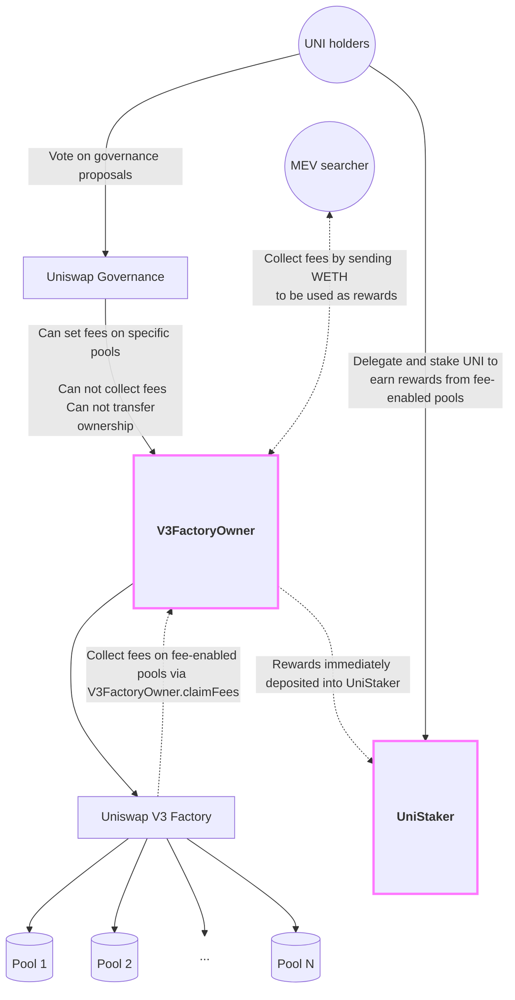
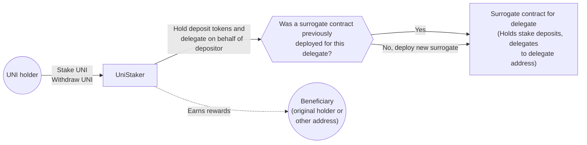

# UniStaker

<div align="center">
	
	<br />
</div>

<p align="center">
	<b>Uniswap V3 protocol fee collection and distribution via UNI staking.</b>
</p>

## What it does

This repository contains contracts which allow Uniswap Governance to enable and manage protocol fees on Uniswap V3. If Uniswap Governance chooses to upgrade to these contracts, it will retain the right to set protocol fees on Uniswap V3 Pools but it will not control the fee assets themselves. Instead, the revenue generated by the fees is trustlessly distributed to those UNI holders who choose to delegate and stake their tokens.

Rewards do not accumulate to stakers in the fee tokens. Rather, rewards accumulate in a token defined during the deployment of the contracts in this repo. The fees accrued by each pool are continually auctioned to any entity who is willing to pay a fixed amount of that token to the staking contract in exchange for the fee tokens accrued by a given pool.

UNI holders who stake their tokens are required to delegate their governance voting weight, either to themselves, or to another entity who can vote on their behalf.

Stakers earn a share of rewards proportional to their share of the total UNI staked. Stakers only earn rewards while their tokens are deposited. When a staker deposits, they earn a share of the ongoing reward distribution. When a staker withdraws, they stop earning rewards.

Stakers may designate an address which is the beneficiary of their staking rewards. This means an address can earn rewards on behalf of the original depositing address of the UNI tokens. The address which performs the deposit retains the right to withdraw and update the staking position.

Each deposit is tracked on a per-position basis. Stakers may add to or withdraw UNI from a given deposit balance, or may alter the governance delegation and reward beneficiary associated with that deposit. A given address can have any number of deposit positions which are each tracked and managed independently.

To take effect, Uniswap Governance must successfully pass a vote to upgrade ownership of the V3 factory to this system. Once transferred to these contracts, that ownership cannot be revoked. While Governance may continue to adjust fee levels and rewards parameters, it irrevocably relinquishes the ability to claim the fees earned for itself. These would forever be distributed to UNI stakers.

The staking system allows for other contracts to be added as revenue sources for staking reward distribution in the future.

## How it works

The system consists of two core contracts which are designed to be deployed into, and interact with, the existing ecosystem of Uniswap contracts operating onchain. The two new contracts are `V3FactoryOwner.sol` and the `UniStaker.sol`. The former manages ownership of the existing Uniswap V3 Factory contract, while the latter manages staking mechanics and the distribution of rewards to stakers.



### `V3FactoryOwner`

The [`V3FactoryOwner`](src/V3FactoryOwner.sol) contract is designed to act as the owner of the Uniswap V3 Factory. Governance can opt to transfer ownership of the factory to an instance of this contract. While the owner of the factory becomes the `V3FactoryOwner`, the admin of the `V3FactoryOwner` will be governance. In this way, governance retains the right to configure pool protocol fees via permissioned passthrough methods.

The `V3FactoryOwner` has a public method which enables _anyone_ to claim the protocol fees which have accrued for a given pool. In order to claim the fees, the caller must pay a fixed amount of a token defined when the `V3FactoryOwner` is deployed (the `PAYOUT_TOKEN`). This sets up a continuous "race" wherein external parties will compete to claim the fees accrued by each pool once it becomes profitable to do so.

Concretely, if the `PAYOUT_TOKEN` was WETH, a third party would claim a pool's fees by paying for them in WETH, which would be sent to the staking contract for distribution to stakers.

### `UniStaker`

The mechanics of the [`UniStaker`](src/UniStaker.sol) contract are heavily inspired by the Synthetix [`StakingRewards.sol`](https://github.com/Synthetixio/synthetix/blob/develop/contracts/StakingRewards.sol) implementation. The contract manages the distribution of rewards to stakers by dripping those rewards out over a fixed period of time. This period restarts if more rewards are distributed (e.g. by the public fee claiming mechanism on `V3FactoryOwner` detailed above). This Synthetix style staking mechanism has been widely discussed in the DeFi ecosystem and should be reviewed by any party seeking to understand the mechanics of UniStaker.



The UniStaker contract diverges from `StakingRewards.sol` in several ways:

First, UniStaker enfranchises depositors by allowing them to retain their UNI governance rights. It does this by depositing staked tokens to an instance of [`DelegationSurrogate`](src/DelegationSurrogate.sol), a dummy contract whose sole purpose is to delegate voting weight to a designated entity. UniStaker requires stakers to delegate to themselves or another address. They cannot delegate to the zero address.

Second, UniStaker allows depositors to designate the beneficiary of their staking rewards. Effectively, any given deposit can earn rewards on behalf of any designated address.

Third, UniStaker tracks stake on a per-deposit basis. Stakers may add to or withdraw UNI from a given deposit balance, or may alter the governance delegation and reward beneficiary associated with that deposit. A given address can have any number of deposit positions which are each tracked and managed independently.

Fourth, UniStaker has a bevy of small improvements to the Synthetix staking mechanism. These include optimizations for greater precision, lower gas usage, and refactoring for the sake of clearer code.

Finally, UniStaker is designed to accept rewards from any number of addresses designated by the admin. While Uniswap V3 protocol fees will be the only source of rewards initially, it is possible to add more in the future. Uniswap Governance will serve as the admin with the ability to add reward sources in the future.

## Development

These contracts were built and tested with care by the team at [ScopeLift](https://scopelift.co).

### Build and test

This project uses [Foundry](https://github.com/foundry-rs/foundry). Follow [these instructions](https://github.com/foundry-rs/foundry#installation) to install it.

Clone the repo.

Set up your .env file

```bash
cp .env.template .env
# edit the .env to fill in values
```

Install dependencies & run tests.

```bash
forge install
forge build
forge test
```

### Spec and lint

This project uses [scopelint](https://github.com/ScopeLift/scopelint) for linting and spec generation. Follow [these instructions](https://github.com/ScopeLift/scopelint?tab=readme-ov-file#installation) to install it.

To use scopelint's linting functionality, run:

```bash
scopelint check # check formatting
scopelint fmt # apply formatting changes
```

To use scopelint's spec generation functionality, run:

```bash
scopelint spec
```

This command will use the names of the contract's unit tests to generate a human readable spec. It will list each contract, its constituent functions, and the human readable description of functionality each unit test aims to assert.

## License

The code in this repository is licensed under the [GNU Affero General Public License](LICENSE) unless otherwise indicated.

Copyright (C) 2024 The Uniswap Foundation
